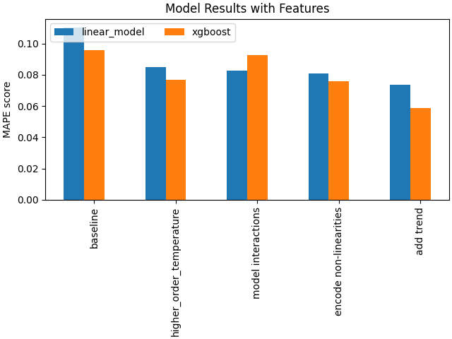
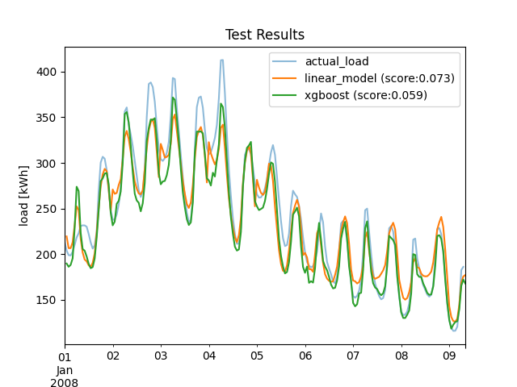

# Smart Home Energy Demand Forecasting

An end-to-end pipeline using temperature data for prediction electricity demand.

## Project Description

The repository includes exploration, training, and inference pipelines for an interpretable linear model (interpretable) and Xgboost model.

## Dashboard Snapshot
The [interactive UI](https://load-forcasting.streamlit.app/) provides an interface for viewing the result of different trained models as well as exploring the data. A snapshot of the dashboard is available here:

## Analysis
Below is a summany of the Analysis. The relevant exploratory analysis notebook with code for generating the plots and more may be found [here](./notebooks/01-data-exploration.ipynb)

## Modelling Results
The figure shows the influence of added features on the model performance (MAPE); and the test result for the best version of each model, as explored in the notebook [here](./notebooks/03-training.ipynb). 

 

## Reproducing Dashboard
The dashboard provides an interactive interface for viewing the result of different trained models as well as exploring the data.

To launch dashboard:

1. clone the repo and push in your github.
2. SignUp in Streamlit.
3. Create app in Streamlit.
4. Deploy a public app from github.
5. Select your repository where you pushed the code.
6. Select the main file path as app.py

## Technologies

- Numpy
- Scipy
- Scikit-learn
- matplotlib
- etc.
